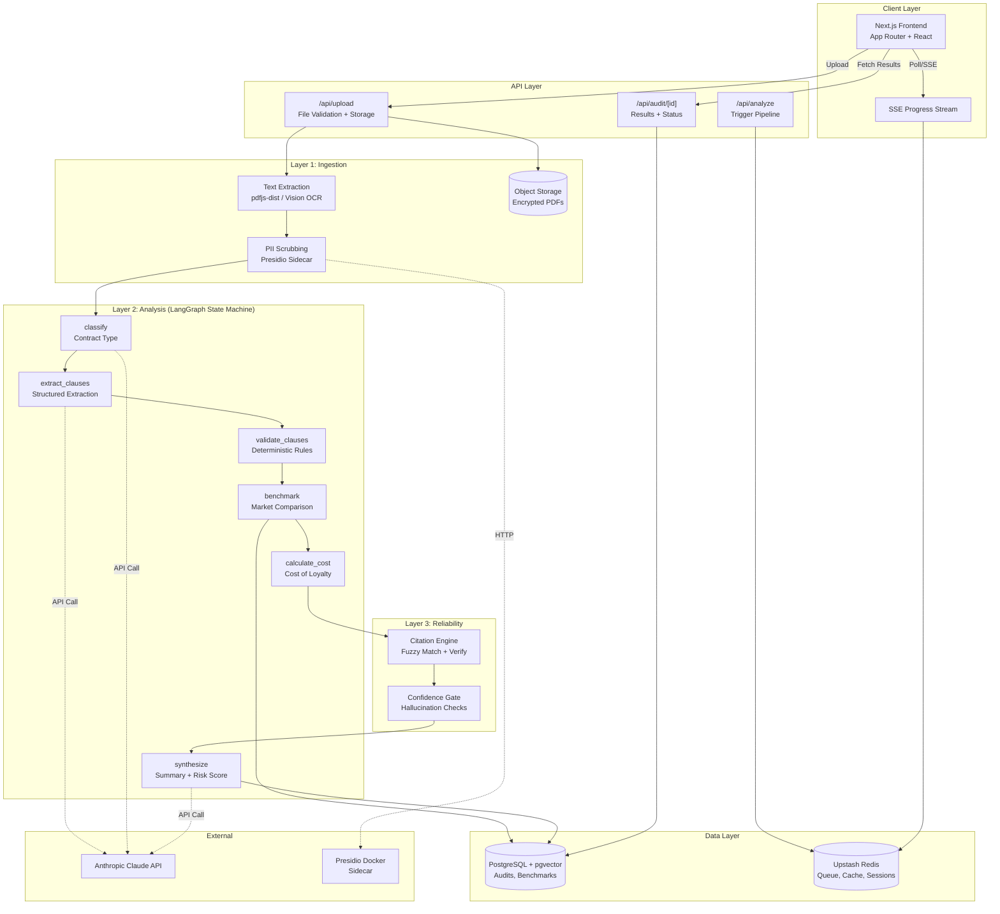
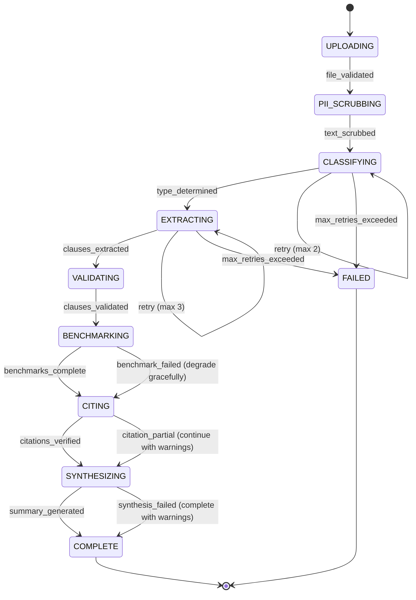
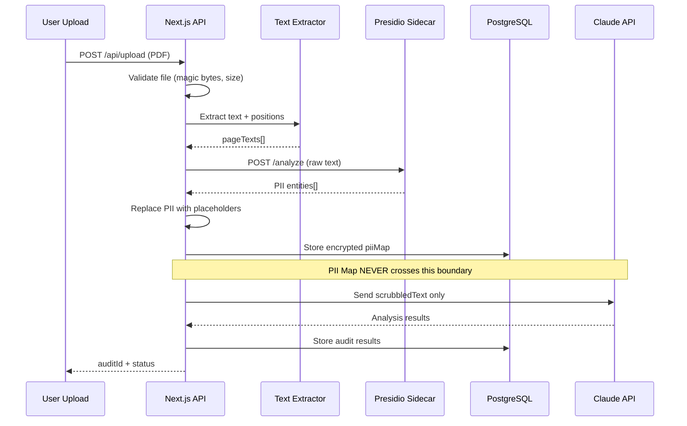
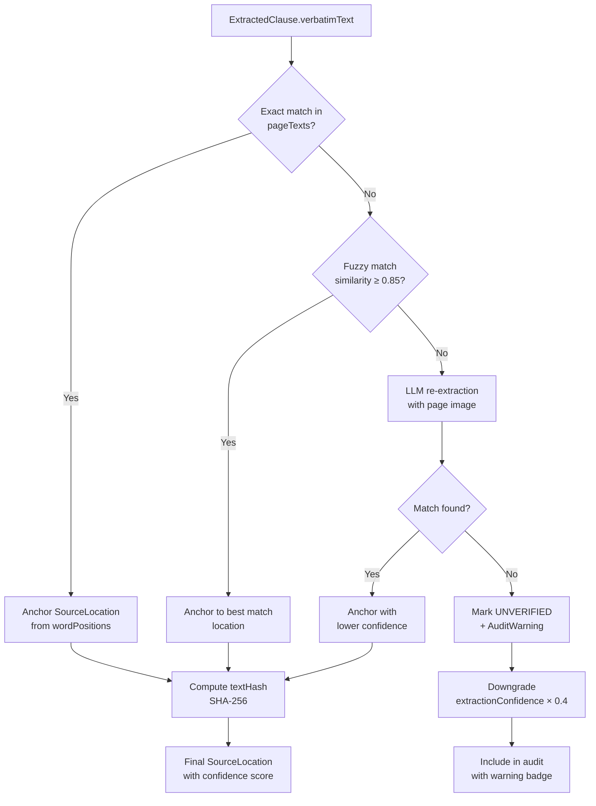

# SYSTEM_DESIGN: Information Asymmetry Defense Bot

> **Version:** 1.0.0 | **Sprint Duration:** 4 Days | **Codename:** SHIELD  
> **Target:** Wealthsimple AI Builders Challenge  
> **Audience:** Autonomous coding agents (Claude Code, Antigravity)

---

## Table of Contents

1. [The One Decision Rationale](#1-the-one-decision-rationale)
2. [System Overview & Tech Stack](#2-system-overview--tech-stack)
3. [Core TypeScript Interfaces](#3-core-typescript-interfaces)
4. [Layer 1: Intelligent Ingestion & PII Scrubbing](#4-layer-1-intelligent-ingestion--pii-scrubbing)
5. [Layer 2: Forensic Analysis & State Machine](#5-layer-2-forensic-analysis--state-machine)
6. [Layer 3: Reliability & Anti-Hallucination Guardrails](#6-layer-3-reliability--anti-hallucination-guardrails)
7. [Layer 4: Frontend & Human-in-the-Loop UI](#7-layer-4-frontend--human-in-the-loop-ui)
8. [Error Handling Contract](#8-error-handling-contract)
9. [Architecture Diagrams](#9-architecture-diagrams)

---

## 1. The One Decision Rationale

### The Decision the AI Is Forbidden From Making

The Information Asymmetry Defense Bot will calculate, with mathematical precision, the exact dollar-and-cents "Cost of Loyalty"—the premium a consumer pays by remaining bound to a legacy financial product rather than switching to a fair-market alternative. It will decompose a 30-year mortgage into its true lifetime cost, surface the buried prepayment penalty on page 47 of a lease, and quantify the compounding damage of an above-market interest rate spread across a decade. **What it will never do is tell the human whether to act on that number.**

This is not a limitation of the technology. It is a foundational design principle rooted in fiduciary responsibility. A true fiduciary—a human financial advisor bound by law to act in a client's best interest—is obligated to present material facts and ensure informed consent. But even a fiduciary recognizes that "best interest" is not a purely mathematical concept. A consumer may know that their current mortgage rate is 87 basis points above market. They may also know that their local credit union funded their first business loan when no one else would, that the branch manager attended their mother's funeral, that switching institutions would sever a relationship that has compounded in trust, not just in interest. The Cost of Loyalty is a number. The *value* of loyalty is a story, and stories are not computable.

Large language models are, at their core, extraordinarily sophisticated pattern-completion engines. They can simulate empathy; they cannot experience it. They can model decision trees; they cannot feel the weight of a decision. When a consumer stares at a $14,200 Cost of Loyalty figure and asks, "But is it worth it?"—the answer lives in a domain that is categorically outside the reach of any model, no matter how large its context window. It lives in the consumer's memory of a handshake, in their assessment of their own financial resilience, in their tolerance for the cognitive overhead of switching providers, in their values. To have the AI answer that question would be to commit the deepest form of information asymmetry: presenting a machine's confident pattern-match as a substitute for human judgment on a matter that is irreducibly human.

The architecture therefore enforces a hard boundary. The system's final output is a structured "Decision Package"—a complete forensic audit, a calculated Cost of Loyalty, a side-by-side comparison with fair-market alternatives, and a plain-language summary of every material risk. This package is delivered to the user with a single, deliberate call to action: **"You decide."** There is no "recommended action." There is no green button that says "Switch Now" and no red button that says "Stay." The UI presents a neutral decision interface that refuses to nudge.

This constraint is also a defense against the subtle failure mode of algorithmic paternalism. If the bot recommended switching, it would optimize for a single axis—financial cost—and systematically devalue every axis it cannot measure: convenience, trust, community, habit, risk aversion. Over time, such a system would train its users to outsource judgment, eroding the very financial agency it was designed to protect. By refusing to cross the decision boundary, the bot instead *strengthens* the user's capacity for informed choice. It says: "Here is everything you need to know. The math is done. The traps are flagged. Now, exercise your judgment—because this is your life, and no model, however intelligent, lives it for you."

This is the One Decision: **the human decides whether their personal context is worth the calculated cost.** The AI illuminates. The human chooses.

---

## 2. System Overview & Tech Stack

### Architecture Philosophy

Modular monolith for the MVP sprint. Each "Layer" is a discrete module with strict interface boundaries, deployable as a monolith on Day 1 and decomposable into microservices post-MVP.

### Tech Stack

| Layer | Technology | Rationale |
|---|---|---|
| **Frontend** | Next.js 14 (App Router) + TypeScript | Server components for SEO, client components for interactive Reasoning Tree |
| **API Gateway** | Next.js Route Handlers (`/app/api/`) | Collocated with frontend, zero-config deployment on Vercel |
| **Agentic Backend** | Node.js with LangGraph.js | TypeScript end-to-end; state machine orchestration with typed channels |
| **LLM Provider** | Anthropic Claude (via `@anthropic-ai/sdk`) | Best-in-class document comprehension; native PDF vision |
| **OCR Fallback** | Tesseract.js (client) / `pdf-parse` + `pdfjs-dist` (server) | For degraded/scanned PDFs where vision alone is insufficient |
| **PII Engine** | Microsoft Presidio (self-hosted, Python sidecar via Docker) | Deterministic NER-based PII detection, not LLM-dependent |
| **Database** | PostgreSQL 16 + pgvector extension | Structured audit storage + vector similarity for benchmark matching |
| **Cache/Queue** | Upstash Redis (serverless) | Rate limiting, job queue for async analysis, session state |
| **Object Storage** | Vercel Blob or AWS S3 | Raw document storage (encrypted at rest, TTL-scoped) |
| **Deployment** | Vercel (frontend + API) + Railway/Fly.io (Presidio sidecar) | Fastest path to production in a 4-day sprint |

### Directory Structure

```
shield/
├── apps/
│   └── web/                    # Next.js 14 application
│       ├── app/
│       │   ├── api/
│       │   │   ├── upload/     # Document ingestion endpoint
│       │   │   ├── analyze/    # Trigger analysis pipeline
│       │   │   └── audit/[id]/ # Retrieve audit results
│       │   ├── dashboard/      # Main UI
│       │   └── audit/[id]/     # Audit detail + Reasoning Tree
│       └── lib/
│           ├── agents/         # LangGraph state machine
│           ├── ingestion/      # Layer 1: Upload + PII
│           ├── analysis/       # Layer 2: Clause extraction
│           ├── citations/      # Layer 3: Citation engine
│           └── benchmarks/     # Market data comparisons
├── packages/
│   └── types/                  # Shared TypeScript interfaces
├── services/
│   └── presidio/               # Dockerized PII scrubbing sidecar
└── prisma/
    └── schema.prisma           # Database schema
```

---

## 3. Core TypeScript Interfaces

All coding agents **must** implement these interfaces exactly. They are the contract between every module in the system.

```typescript
// ============================================================
// packages/types/src/index.ts
// ============================================================

// --- Enums ---

export enum ContractType {
  MORTGAGE = "MORTGAGE",
  AUTO_LEASE = "AUTO_LEASE",
  AUTO_LOAN = "AUTO_LOAN",
  CREDIT_CARD = "CREDIT_CARD",
  PERSONAL_LOAN = "PERSONAL_LOAN",
  LINE_OF_CREDIT = "LINE_OF_CREDIT",
  INSURANCE_POLICY = "INSURANCE_POLICY",
  INVESTMENT_AGREEMENT = "INVESTMENT_AGREEMENT",
  UNKNOWN = "UNKNOWN",
}

export enum SeverityLevel {
  /** Informational — no action required */
  INFO = "INFO",
  /** Slightly above market but within tolerance */
  LOW = "LOW",
  /** Materially above market or contains unfavorable terms */
  MEDIUM = "MEDIUM",
  /** Predatory clause, hidden fee, or significant financial harm */
  HIGH = "HIGH",
  /** Potentially illegal or regulatory-violation-level clause */
  CRITICAL = "CRITICAL",
}

export enum AuditStatus {
  UPLOADING = "UPLOADING",
  PII_SCRUBBING = "PII_SCRUBBING",
  CLASSIFYING = "CLASSIFYING",
  EXTRACTING = "EXTRACTING",
  BENCHMARKING = "BENCHMARKING",
  CITING = "CITING",
  COMPLETE = "COMPLETE",
  FAILED = "FAILED",
}

export enum PIIEntityType {
  PERSON_NAME = "PERSON_NAME",
  PHONE_NUMBER = "PHONE_NUMBER",
  EMAIL_ADDRESS = "EMAIL_ADDRESS",
  CREDIT_CARD_NUMBER = "CREDIT_CARD_NUMBER",
  BANK_ACCOUNT = "BANK_ACCOUNT",
  SSN_SIN = "SSN_SIN",
  ADDRESS = "ADDRESS",
  DATE_OF_BIRTH = "DATE_OF_BIRTH",
}

// --- Source Location (Citation Anchor) ---

/**
 * Pinpoints exactly where in the source document a piece of
 * information was extracted from. This is the atomic unit of
 * the Citation Engine (Layer 3).
 */
export interface SourceLocation {
  /** 1-indexed page number in the original PDF */
  pageNumber: number;
  /** Bounding box coordinates as percentages of page dimensions (0-1) */
  boundingBox: {
    topLeftX: number;
    topLeftY: number;
    bottomRightX: number;
    bottomRightY: number;
  };
  /** The exact verbatim text extracted from the source */
  verbatimText: string;
  /** SHA-256 hash of verbatimText for tamper detection */
  textHash: string;
  /** Character offset range within the full document text */
  charOffsetStart: number;
  charOffsetEnd: number;
}

// --- PII Scrubbing ---

export interface PIIEntity {
  entityType: PIIEntityType;
  originalValue: string;
  redactedPlaceholder: string; // e.g., "[PERSON_1]", "[ACCOUNT_***4523]"
  confidence: number; // 0-1
  location: SourceLocation;
}

export interface PIIScrubResult {
  /** The full document text with PII replaced by placeholders */
  scrubbledText: string;
  /** Map of placeholder -> original value (stored encrypted, never sent to LLM) */
  piiMap: Record<string, string>;
  /** All detected entities with their locations */
  entities: PIIEntity[];
  /** Total PII instances redacted */
  totalRedacted: number;
}

// --- Extracted Clauses ---

/**
 * A single clause or term extracted from the contract.
 * Every clause MUST have a SourceLocation — no exceptions.
 */
export interface ExtractedClause {
  /** Unique ID within this audit */
  clauseId: string;
  /** Human-readable label, e.g., "Prepayment Penalty" */
  label: string;
  /** Category for grouping in the UI */
  category:
    | "interest_rate"
    | "fees"
    | "penalties"
    | "insurance"
    | "collateral"
    | "term_conditions"
    | "rights_obligations"
    | "early_termination"
    | "variable_rate_terms"
    | "other";
  /** The raw extracted value (e.g., "4.99%", "$450", "36 months") */
  rawValue: string;
  /** Parsed numeric value where applicable (e.g., 4.99, 450, 36) */
  numericValue: number | null;
  /** Unit of the numeric value (e.g., "percent", "CAD", "months") */
  unit: string | null;
  /** Plain-language explanation of what this clause means */
  plainLanguageSummary: string;
  /** Source location in the document — REQUIRED, never null */
  source: SourceLocation;
  /** Confidence score for extraction accuracy (0-1) */
  extractionConfidence: number;
}

// --- Benchmark Comparison ---

export interface BenchmarkDataPoint {
  /** Source of benchmark data (e.g., "Bank of Canada Prime", "Wealthsimple Mortgage") */
  sourceName: string;
  /** The benchmark value */
  value: number;
  unit: string;
  /** When this benchmark was last updated (ISO 8601) */
  asOfDate: string;
  /** URL or reference for verification */
  referenceUrl: string | null;
}

export interface ClauseBenchmark {
  clauseId: string;
  /** The user's contract value */
  contractValue: number;
  contractUnit: string;
  /** The fair-market benchmark */
  benchmark: BenchmarkDataPoint;
  /** Absolute delta (contract - benchmark) */
  delta: number;
  /** Percentage deviation from benchmark */
  deltaPercent: number;
  /** Projected cost over full contract term in CAD */
  projectedCostImpact: number;
  /** Is this delta in the consumer's favor or against? */
  direction: "FAVORABLE" | "UNFAVORABLE" | "NEUTRAL";
}

// --- Audit Issues (Flagged Problems) ---

/**
 * A single issue flagged by the forensic analysis.
 * Every issue is grounded in one or more ExtractedClauses
 * and carries a full citation chain.
 */
export interface AuditIssue {
  issueId: string;
  severity: SeverityLevel;
  /** Short headline, e.g., "Above-Market Interest Rate" */
  title: string;
  /** 2-3 sentence plain-language explanation */
  description: string;
  /** Detailed analysis for users who want to dig deeper */
  detailedAnalysis: string;
  /** The specific clauses that triggered this issue */
  relatedClauses: ExtractedClause[];
  /** Benchmark comparison data (if applicable) */
  benchmarkComparison: ClauseBenchmark | null;
  /** Estimated financial impact over contract lifetime (CAD) */
  estimatedLifetimeCost: number | null;
  /** Tags for filtering/search */
  tags: string[];
  /** The LLM's confidence in this finding (0-1) */
  confidence: number;
}

// --- Cost of Loyalty ---

/**
 * The central output metric. This is the number the human
 * uses to make their One Decision.
 */
export interface CostOfLoyalty {
  /** Total estimated excess cost of staying with current contract (CAD) */
  totalCost: number;
  /** Breakdown by category */
  breakdown: {
    category: string;
    amount: number;
    description: string;
  }[];
  /** Time horizon for the calculation */
  timeHorizonMonths: number;
  /** Assumptions made in the calculation */
  assumptions: string[];
  /** Confidence interval */
  confidenceRange: {
    low: number;
    mid: number;
    high: number;
  };
}

// --- The Top-Level Audit Object ---

/**
 * The complete audit — this is the primary entity in the system.
 * All API responses for a completed audit return this shape.
 */
export interface ContractAudit {
  /** UUID v4 */
  auditId: string;
  /** Current pipeline status */
  status: AuditStatus;
  /** Timestamps */
  createdAt: string;
  updatedAt: string;
  completedAt: string | null;
  /** Detected contract type */
  contractType: ContractType;
  /** Original filename (PII-safe — no path info) */
  originalFileName: string;
  /** SHA-256 hash of original uploaded file */
  documentHash: string;
  /** PII scrub results (piiMap is NEVER included in API responses) */
  piiSummary: {
    totalRedacted: number;
    entityTypeCounts: Record<PIIEntityType, number>;
  };
  /** All extracted clauses */
  clauses: ExtractedClause[];
  /** All flagged issues, sorted by severity DESC */
  issues: AuditIssue[];
  /** The Cost of Loyalty calculation */
  costOfLoyalty: CostOfLoyalty;
  /** Overall risk score (0-100, higher = more risk) */
  riskScore: number;
  /** Executive summary in plain language */
  executiveSummary: string;
  /** Errors encountered during processing (non-fatal) */
  warnings: AuditWarning[];
}

export interface AuditWarning {
  code: string;
  message: string;
  recoverable: boolean;
  /** Which pipeline stage generated this warning */
  stage: AuditStatus;
}

// --- State Machine Types (LangGraph) ---

/**
 * The state object that flows through the LangGraph state machine.
 * Every node reads from and writes to this typed state.
 */
export interface AgentState {
  /** The audit being constructed */
  audit: Partial<ContractAudit>;
  /** Raw text after PII scrubbing (this is what the LLM sees) */
  scrubbledDocumentText: string;
  /** Page-by-page text with positional metadata */
  pageTexts: {
    pageNumber: number;
    text: string;
    /** Word-level bounding boxes from OCR/extraction */
    wordPositions: {
      word: string;
      boundingBox: SourceLocation["boundingBox"];
      charOffset: number;
    }[];
  }[];
  /** Accumulated errors — non-fatal errors don't stop the pipeline */
  errors: AuditWarning[];
  /** Current node in the state machine */
  currentNode: string;
  /** Retry counts per node */
  retryCounters: Record<string, number>;
}

// --- API Request/Response Types ---

export interface UploadRequest {
  /** Base64-encoded file content */
  fileContent: string;
  /** MIME type */
  mimeType: "application/pdf" | "image/png" | "image/jpeg" | "image/webp";
  /** Original filename */
  fileName: string;
}

export interface UploadResponse {
  auditId: string;
  status: AuditStatus;
  message: string;
}

export interface AuditStatusResponse {
  auditId: string;
  status: AuditStatus;
  progress: number; // 0-100
  currentStage: string;
  estimatedSecondsRemainingb: number | null;
}

export interface AuditResultResponse {
  audit: ContractAudit;
  /** Pre-signed URL to view original document (time-limited) */
  documentViewUrl: string;
}
```

---

## 4. Layer 1: Intelligent Ingestion & PII Scrubbing

### Design Principle

**PII never reaches the LLM.** This is a hard invariant, not a guideline. The PII scrubbing interceptor sits between document upload and *any* LLM call. It is a deterministic, rule-based system — not an LLM feature.

### Pipeline

```
User Upload → File Validation → Text Extraction → PII Detection → PII Redaction → Scrubbed Text
                                                                           ↓
                                                              Encrypted PII Map (DB only)
```

### 4.1 File Validation

```typescript
// Validation rules — reject before any processing
const UPLOAD_CONSTRAINTS = {
  maxFileSizeMB: 25,
  allowedMimeTypes: [
    "application/pdf",
    "image/png",
    "image/jpeg",
    "image/webp",
  ] as const,
  maxPageCount: 100,
  // Reject files that are clearly not contracts
  minTextLength: 200, // chars — below this, likely a blank or corrupt file
};
```

The upload endpoint must:
1. Validate MIME type via magic bytes (not file extension).
2. Compute SHA-256 hash of the raw file for deduplication and audit trail.
3. Store the raw file in object storage with a 30-day TTL and AES-256 encryption at rest.
4. Return the `auditId` immediately and begin async processing.

### 4.2 Text Extraction Strategy

Use a two-pass strategy:

**Pass 1 — Structured Extraction:** Use `pdfjs-dist` to extract text with positional metadata (x, y, width, height per text item). This gives us the `wordPositions` array for citation anchoring.

**Pass 2 — Vision Fallback:** If Pass 1 yields fewer than `minTextLength` characters (scanned PDF), send page images to Claude's vision capability for OCR. Map extracted text back to page coordinates using the image dimensions.

**Critical:** Both passes must produce the `pageTexts` array on `AgentState` with full positional metadata. The Citation Engine (Layer 3) depends on this.

### 4.3 PII Scrubbing Interceptor

**Implementation: Microsoft Presidio running as a Docker sidecar.**

The interceptor is called via HTTP from the Node.js backend. It is NOT an LLM-based system.

```typescript
// Pseudocode for the PII interceptor contract
interface PresidioAnalyzeRequest {
  text: string;
  language: "en";
  entities: PIIEntityType[];
  /** Score threshold — only redact above this confidence */
  scoreThreshold: 0.7;
}

interface PresidioAnalyzeResponse {
  results: {
    entity_type: string;
    start: number;     // char offset
    end: number;       // char offset
    score: number;
    recognition_metadata: Record<string, unknown>;
  }[];
}
```

**Redaction Rules:**

| Entity Type | Redaction Pattern | Example |
|---|---|---|
| `PERSON_NAME` | `[PERSON_N]` (incrementing) | John Smith → `[PERSON_1]` |
| `SSN_SIN` | `[SSN_REDACTED]` | 123-45-6789 → `[SSN_REDACTED]` |
| `BANK_ACCOUNT` | `[ACCOUNT_***NNNN]` (last 4 digits) | 98765432 → `[ACCOUNT_***5432]` |
| `PHONE_NUMBER` | `[PHONE_REDACTED]` | (416) 555-0123 → `[PHONE_REDACTED]` |
| `EMAIL_ADDRESS` | `[EMAIL_REDACTED]` | john@bank.com → `[EMAIL_REDACTED]` |
| `ADDRESS` | `[ADDRESS_N]` (incrementing) | 123 Main St → `[ADDRESS_1]` |
| `DATE_OF_BIRTH` | `[DOB_REDACTED]` | 1990-05-15 → `[DOB_REDACTED]` |
| `CREDIT_CARD_NUMBER` | `[CC_***NNNN]` | 4111...1234 → `[CC_***1234]` |

**Critical Implementation Notes:**

1. The `piiMap` (placeholder → original value) is stored **encrypted** in PostgreSQL, keyed to the `auditId`. It is **never** included in API responses, **never** sent to the LLM, and **never** logged.
2. Character offsets from Presidio must be mapped back to the `pageTexts` positional data so that PII locations can be tracked even after redaction shifts character positions.
3. The scrubbing interceptor must be **idempotent** — running it twice on the same text produces the same output with the same placeholders.

### 4.4 Presidio Custom Recognizers

Add custom recognizers for Canadian financial document patterns:

```python
# Custom recognizer patterns (for Presidio configuration)
CANADIAN_SIN_PATTERN = r"\b\d{3}[-\s]?\d{3}[-\s]?\d{3}\b"
CANADIAN_TRANSIT_NUMBER = r"\b\d{5}[-\s]?\d{3}\b"  # Bank transit numbers
MORTGAGE_ACCOUNT_PATTERN = r"\b\d{3}[-\s]?\d{7,12}\b"
```

---

## 5. Layer 2: Forensic Analysis & State Machine

### 5.1 State Machine Design (LangGraph.js)

The analysis pipeline is a **deterministic state machine**, not a free-form agent. Every transition is typed, every node has explicit retry logic, and the state is fully serializable for debugging and replay.

#### State Machine Nodes

| Node ID | Input | Output | Max Retries | Timeout |
|---|---|---|---|---|
| `classify` | `scrubbledDocumentText` | `audit.contractType` | 2 | 15s |
| `extract_clauses` | `scrubbledDocumentText`, `contractType` | `audit.clauses` | 3 | 60s |
| `validate_clauses` | `audit.clauses` | validated `audit.clauses` | 1 | 10s |
| `benchmark` | `audit.clauses`, `contractType` | `audit.issues`, benchmarks | 2 | 30s |
| `calculate_cost` | `audit.issues`, benchmarks | `audit.costOfLoyalty` | 1 | 10s |
| `generate_citations` | `audit.clauses`, `pageTexts` | cited `audit.clauses` | 2 | 30s |
| `synthesize` | entire `audit` | `executiveSummary`, `riskScore` | 2 | 30s |

#### Transition Rules

```typescript
// State machine transition map
const TRANSITIONS: Record<string, { next: string; onError: string }> = {
  classify:           { next: "extract_clauses",    onError: "classify_retry" },
  classify_retry:     { next: "extract_clauses",    onError: "failed" },
  extract_clauses:    { next: "validate_clauses",   onError: "extract_retry" },
  extract_retry:      { next: "validate_clauses",   onError: "failed" },
  validate_clauses:   { next: "benchmark",          onError: "benchmark" }, // non-fatal
  benchmark:          { next: "calculate_cost",      onError: "calculate_cost" }, // degrade gracefully
  calculate_cost:     { next: "generate_citations",  onError: "generate_citations" },
  generate_citations: { next: "synthesize",          onError: "synthesize" },
  synthesize:         { next: "complete",             onError: "complete" }, // always complete
};
```

### 5.2 Node: `classify`

**Purpose:** Determine the contract type from the scrubbed text.

**LLM Prompt Strategy:** Single-shot classification with a constrained output schema. The LLM must return exactly one value from the `ContractType` enum.

```typescript
// Classification prompt template
const CLASSIFY_SYSTEM_PROMPT = `You are a document classifier for financial contracts.
Given the text of a consumer financial document, classify it into exactly ONE of these types:
${Object.values(ContractType).join(", ")}

Respond with ONLY a JSON object: { "contractType": "<TYPE>", "confidence": <0-1> }
Do not explain. Do not hedge.`;
```

**Validation:** If `confidence < 0.6`, set `contractType = UNKNOWN` and add an `AuditWarning`. The pipeline continues — `UNKNOWN` contracts still get clause extraction, just without type-specific extraction templates.

### 5.3 Node: `extract_clauses`

**Purpose:** Map unstructured contract text to an array of `ExtractedClause` objects.

**Strategy:** Use type-specific extraction templates. Each `ContractType` has a predefined list of clauses to look for. The LLM is given this list and must attempt to extract each one.

```typescript
// Clause extraction templates per contract type
const EXTRACTION_TEMPLATES: Record<ContractType, string[]> = {
  [ContractType.MORTGAGE]: [
    "principal_amount", "interest_rate", "amortization_period",
    "term_length", "payment_frequency", "prepayment_privileges",
    "prepayment_penalty", "rate_type", "rate_adjustment_formula",
    "property_tax_escrow", "insurance_requirements",
    "default_clauses", "acceleration_clause", "assignment_clause",
    "early_renewal_penalty", "discharge_fee", "collateral_charge_vs_standard",
  ],
  [ContractType.AUTO_LEASE]: [
    "monthly_payment", "lease_term", "mileage_allowance",
    "excess_mileage_rate", "residual_value", "acquisition_fee",
    "disposition_fee", "wear_and_tear_policy", "early_termination_fee",
    "purchase_option_price", "gap_insurance", "security_deposit",
  ],
  // ... other types follow the same pattern
  [ContractType.UNKNOWN]: [
    "total_cost", "interest_rate", "term_length", "fees",
    "penalties", "early_termination", "renewal_terms",
  ],
};
```

**LLM Prompt Strategy:** The extraction prompt must instruct the LLM to:
1. Extract each clause from the template list.
2. For each clause, provide the `verbatimText` (exact quote from the document).
3. Provide the approximate page number.
4. If a clause is not found, explicitly return `null` for that clause (do not hallucinate).

**Output Schema Enforcement:** The LLM must return a JSON array conforming to `ExtractedClause[]`. Use structured output / tool-use mode to enforce the schema.

### 5.4 Node: `validate_clauses`

**Purpose:** Deterministic validation of extracted clauses. This is NOT an LLM call.

```typescript
// Validation rules (deterministic, no LLM)
interface ClauseValidationRule {
  clauseLabel: string;
  validate: (clause: ExtractedClause) => ValidationResult;
}

interface ValidationResult {
  valid: boolean;
  reason?: string;
}

// Example rules
const VALIDATION_RULES: ClauseValidationRule[] = [
  {
    clauseLabel: "interest_rate",
    validate: (c) => {
      if (c.numericValue !== null && (c.numericValue < 0 || c.numericValue > 30)) {
        return { valid: false, reason: "Interest rate outside plausible range (0-30%)" };
      }
      return { valid: true };
    },
  },
  {
    clauseLabel: "principal_amount",
    validate: (c) => {
      if (c.numericValue !== null && c.numericValue < 100) {
        return { valid: false, reason: "Principal amount implausibly low" };
      }
      return { valid: true };
    },
  },
  {
    clauseLabel: "term_length",
    validate: (c) => {
      if (c.numericValue !== null && c.unit === "months" && c.numericValue > 600) {
        return { valid: false, reason: "Term exceeds 50 years — likely extraction error" };
      }
      return { valid: true };
    },
  },
];
```

Invalid clauses are flagged with warnings but **not removed** — the user may still find the raw extraction useful. The `extractionConfidence` is downgraded to `0.3` for failed validations.

### 5.5 Node: `benchmark`

**Purpose:** Compare extracted clauses against fair-market data and flag deviations.

**Benchmark Data Sources (Priority Order):**

1. **Wealthsimple Products** — Hardcoded current rates for Wealthsimple mortgage, savings, investment products. Updated weekly via a config file (no API dependency for MVP).
2. **Bank of Canada** — Prime rate, posted mortgage rates (scraped or API).
3. **Historical Averages** — PostgreSQL table of rolling 90-day averages for common financial products, seeded with initial data.

```typescript
// Benchmark comparison thresholds
const DEVIATION_THRESHOLDS: Record<string, { low: number; medium: number; high: number }> = {
  interest_rate: { low: 0.25, medium: 0.75, high: 1.5 }, // percentage points
  fees: { low: 50, medium: 200, high: 500 },              // CAD
  penalties: { low: 100, medium: 500, high: 2000 },        // CAD
};

// Severity assignment logic
function assignSeverity(delta: number, thresholds: typeof DEVIATION_THRESHOLDS["interest_rate"]): SeverityLevel {
  if (delta <= 0) return SeverityLevel.INFO; // favorable
  if (delta <= thresholds.low) return SeverityLevel.LOW;
  if (delta <= thresholds.medium) return SeverityLevel.MEDIUM;
  if (delta <= thresholds.high) return SeverityLevel.HIGH;
  return SeverityLevel.CRITICAL;
}
```

### 5.6 Node: `calculate_cost`

**Purpose:** Compute the `CostOfLoyalty` object.

**Calculation Method:**

```
Cost of Loyalty = Σ (clause_delta × remaining_term_factor) for all UNFAVORABLE clauses
```

For interest rate deltas, use amortization math to compute the actual dollar difference over the remaining term. For flat fees, sum them directly. For percentage-based penalties, compute against the principal.

**The calculation must produce three values:** `low`, `mid`, and `high` estimates using ±1 standard deviation on the benchmark data. All assumptions must be recorded in the `assumptions` array for transparency.

### 5.7 Node: `synthesize`

**Purpose:** Generate the `executiveSummary` (plain-language, max 300 words) and `riskScore` (0-100).

**Risk Score Formula (deterministic, post-LLM):**

```typescript
function calculateRiskScore(issues: AuditIssue[]): number {
  const weights: Record<SeverityLevel, number> = {
    [SeverityLevel.INFO]: 0,
    [SeverityLevel.LOW]: 5,
    [SeverityLevel.MEDIUM]: 15,
    [SeverityLevel.HIGH]: 30,
    [SeverityLevel.CRITICAL]: 50,
  };

  const rawScore = issues.reduce((sum, issue) => {
    return sum + (weights[issue.severity] * issue.confidence);
  }, 0);

  return Math.min(100, Math.round(rawScore));
}
```

---

## 6. Layer 3: Reliability & Anti-Hallucination Guardrails

### Design Principle

**If the AI can't prove it, the AI can't say it.** Every claim maps to a source coordinate. No source? No claim.

### 6.1 Citation Engine Architecture

The Citation Engine is a **post-processing verification layer**. It runs AFTER clause extraction and cross-references every `ExtractedClause` back to the source document.

#### Citation Verification Pipeline

```
ExtractedClause.verbatimText → Fuzzy Match against pageTexts → SourceLocation
                                      ↓ (no match)
                              LLM Re-extraction with page image → SourceLocation
                                      ↓ (still no match)
                              Flag as UNVERIFIED + AuditWarning
```

#### Fuzzy Matching Strategy

```typescript
interface CitationMatchConfig {
  /** Minimum similarity ratio (0-1) for a fuzzy match to be accepted */
  minSimilarityThreshold: 0.85;
  /** Maximum character distance for near-matches */
  maxLevenshteinDistance: 15;
  /** Whether to normalize whitespace before comparison */
  normalizeWhitespace: true;
  /** Whether to ignore case differences */
  caseInsensitive: true;
}
```

**Implementation:** Use a sliding window over `pageTexts[].text` to find the best match for each `verbatimText`. Compute Levenshtein distance (or Jaro-Winkler similarity). If the best match exceeds the threshold, anchor the citation to that location using the `wordPositions` data.

### 6.2 Confidence Gating

Every LLM output passes through a confidence gate before inclusion in the final audit:

```typescript
interface ConfidenceGate {
  /** Minimum extraction confidence to include a clause */
  clauseMinConfidence: 0.6;
  /** Minimum confidence to include an issue */
  issueMinConfidence: 0.7;
  /** If citation verification fails, downgrade confidence by this factor */
  unverifiedPenalty: 0.4;
  /** Issues below this confidence after all adjustments are demoted to warnings */
  warningThreshold: 0.5;
}
```

### 6.3 Hallucination Detection Heuristics

These are **deterministic checks** run after every LLM response:

| Check | Logic | Action on Failure |
|---|---|---|
| **Phantom Clause** | `verbatimText` has zero fuzzy matches in source document | Demote to `WARNING`, do not include in issues |
| **Numeric Drift** | `numericValue` doesn't match any number within ±1% in `verbatimText` | Re-extract with focused prompt on that specific page |
| **Ghost Page** | `pageNumber` exceeds actual document page count | Re-extract without page hint |
| **Self-Contradiction** | Two clauses for the same label with conflicting values | Flag both, present both to user with a warning |
| **Benchmark Fabrication** | `BenchmarkDataPoint.sourceName` not in the known sources list | Reject benchmark, use only known sources |

### 6.4 LLM Call Discipline

All LLM calls must follow these rules:

1. **Temperature:** `0.0` for extraction and classification. `0.3` for summary generation only.
2. **Structured Output:** Always use tool-use / function-calling mode to enforce JSON schema compliance. Never rely on free-text parsing.
3. **System Prompt Invariant:** Every system prompt must include: `"If you cannot find information in the provided document, respond with null. Do not infer, guess, or fabricate values."`
4. **Token Budget:** Set explicit `max_tokens` per call. Classification: 200. Extraction: 4000. Summary: 1000.

---

## 7. Layer 4: Frontend & Human-in-the-Loop UI

### 7.1 Page Architecture

| Route | Purpose | Key Components |
|---|---|---|
| `/` | Landing + Upload | Drag-and-drop upload zone, file type guidance |
| `/dashboard` | Audit list | Status badges, recent audits, progress indicators |
| `/audit/[id]` | Audit Detail | Reasoning Tree, Cost of Loyalty card, Decision Interface |
| `/audit/[id]/document` | Source Viewer | Side-by-side document with highlighted citations |

### 7.2 The Reasoning Tree UI

The Reasoning Tree is the core UI innovation. It presents the AI's analysis as a navigable, hierarchical tree — not a flat list of bullet points. The user can drill into any finding and trace it back to the exact source text.

#### Component Hierarchy

```
<AuditPage>
├── <CostOfLoyaltyCard>          // Hero metric — the big number
│   ├── <ConfidenceRange>        // Low/Mid/High range visualization
│   └── <AssumptionsDrawer>      // Expandable list of calculation assumptions
├── <RiskScoreGauge>             // 0-100 visual gauge
├── <ReasoningTree>              // The main analysis view
│   ├── <CategoryNode>           // e.g., "Interest Rate Terms"
│   │   ├── <ClauseLeaf>         // e.g., "Fixed Rate: 5.49%"
│   │   │   ├── <BenchmarkBar>   // Visual comparison to market
│   │   │   ├── <IssueFlag>      // Severity badge + description
│   │   │   └── <CitationLink>   // Click to highlight in source doc
│   │   └── <ClauseLeaf>         // ...more clauses
│   └── <CategoryNode>           // ...more categories
├── <DocumentViewer>             // PDF viewer with citation overlays
│   ├── <PageRenderer>           // Renders PDF pages
│   └── <CitationOverlay>        // Draws highlight boxes on source text
└── <DecisionInterface>          // The HITL handoff
    ├── <SummaryPanel>           // Plain-language executive summary
    ├── <CostBreakdownTable>     // Itemized Cost of Loyalty
    └── <DecisionPrompt>         // "You decide." — no recommendation
```

### 7.3 Citation Interaction Flow

When a user clicks a `<CitationLink>` on any clause or issue:

1. The `<DocumentViewer>` scrolls to the relevant page.
2. The `<CitationOverlay>` draws a highlighted bounding box over the `verbatimText` using the `SourceLocation.boundingBox` coordinates.
3. A tooltip shows the extracted value and the AI's interpretation.
4. If the citation is marked `UNVERIFIED`, a warning badge appears on the overlay.

### 7.4 The Decision Interface (HITL Handoff)

The Decision Interface is the final screen. It is deliberately designed to be **non-directive**.

**Design Rules:**
- **No green/red buttons.** No color-coding that implies "go" or "stop."
- **No "Recommended Action" section.** The AI does not recommend.
- **Neutral language only.** The CTA reads: "Review Complete — The Decision Is Yours."
- **Downloadable Report.** The user can export the full audit as a PDF for their records or to share with a human advisor.
- **Optional: "Talk to an Advisor" link.** If Wealthsimple integration allows, a link to book a human consultation.

### 7.5 Real-Time Progress UI

During analysis, the `/audit/[id]` page shows real-time progress:

```typescript
// SSE (Server-Sent Events) event types
type ProgressEvent =
  | { type: "status_change"; status: AuditStatus; progress: number }
  | { type: "clause_found"; clause: Pick<ExtractedClause, "label" | "category" | "rawValue"> }
  | { type: "issue_flagged"; issue: Pick<AuditIssue, "title" | "severity"> }
  | { type: "complete"; auditId: string }
  | { type: "error"; warning: AuditWarning };
```

The UI progressively reveals findings as they stream in, building user confidence that the system is working and providing intermediate value.

---

## 8. Error Handling Contract

### Non-Negotiable Rules for Coding Agents

1. **No silent failures.** Every caught error must produce an `AuditWarning` that reaches the user.
2. **Graceful degradation over hard failure.** If benchmarking fails, the audit still completes — just without benchmark comparisons. If citation verification fails for one clause, that clause is flagged but other clauses are unaffected.
3. **Idempotent retries.** Every node in the state machine can be retried without side effects. The state is the single source of truth.
4. **Structured error codes.** All errors use a codified format:

```typescript
// Error code format: LAYER_NODE_TYPE
const ERROR_CODES = {
  // Layer 1
  "L1_UPLOAD_INVALID_FILE": "File failed validation (type, size, or corruption)",
  "L1_UPLOAD_EXTRACTION_FAILED": "Could not extract text from document",
  "L1_PII_SERVICE_UNAVAILABLE": "Presidio sidecar unreachable",
  "L1_PII_PARTIAL_SCRUB": "Some PII entities could not be redacted",

  // Layer 2
  "L2_CLASSIFY_LOW_CONFIDENCE": "Contract type classification below threshold",
  "L2_EXTRACT_SCHEMA_VIOLATION": "LLM returned non-conforming JSON",
  "L2_EXTRACT_TIMEOUT": "Clause extraction exceeded timeout",
  "L2_BENCHMARK_DATA_STALE": "Benchmark data older than 7 days",
  "L2_BENCHMARK_NO_MATCH": "No benchmark available for this clause type",

  // Layer 3
  "L3_CITE_NO_MATCH": "Verbatim text not found in source document",
  "L3_CITE_LOW_SIMILARITY": "Best match below similarity threshold",
  "L3_HALLUCINATION_DETECTED": "Extracted value contradicts source text",

  // Layer 4
  "L4_SSE_CONNECTION_LOST": "Real-time progress stream interrupted",
  "L4_RENDER_CITATION_FAILED": "Could not render citation overlay on document",
} as const;
```

### Retry Policy

```typescript
interface RetryPolicy {
  maxRetries: number;
  backoffMs: number[];      // Explicit backoff schedule
  retryableErrors: string[]; // Only retry on these error codes
}

const DEFAULT_RETRY_POLICY: RetryPolicy = {
  maxRetries: 3,
  backoffMs: [1000, 3000, 8000], // 1s, 3s, 8s
  retryableErrors: [
    "L2_EXTRACT_SCHEMA_VIOLATION",
    "L2_EXTRACT_TIMEOUT",
    "L3_CITE_NO_MATCH",
    "L1_PII_SERVICE_UNAVAILABLE",
  ],
};
```

---

## 9. Architecture Diagrams

### 9.1 System Architecture Overview



### 9.2 State Machine Flow



### 9.3 PII Scrubbing Data Flow



### 9.4 Citation Verification Flow



---

## Appendix A: Database Schema (Prisma)

```prisma
// prisma/schema.prisma

generator client {
  provider = "prisma-client-js"
}

datasource db {
  provider = "postgresql"
  url      = env("DATABASE_URL")
}

model Audit {
  id               String      @id @default(uuid())
  status           String      @default("UPLOADING")
  contractType     String?
  originalFileName String
  documentHash     String
  documentBlobUrl  String?
  riskScore        Int?
  executiveSummary String?
  costOfLoyalty    Json?       // CostOfLoyalty interface
  warnings         Json[]      // AuditWarning[]
  createdAt        DateTime    @default(now())
  updatedAt        DateTime    @updatedAt
  completedAt      DateTime?

  // Relations
  clauses    Clause[]
  issues     Issue[]
  piiRecord  PIIRecord?

  @@index([status])
  @@index([createdAt])
}

model Clause {
  id                   String  @id @default(uuid())
  auditId              String
  label                String
  category             String
  rawValue             String
  numericValue         Float?
  unit                 String?
  plainLanguageSummary String
  sourceLocation       Json    // SourceLocation interface
  extractionConfidence Float
  verified             Boolean @default(false)

  audit  Audit   @relation(fields: [auditId], references: [id], onDelete: Cascade)
  issues Issue[] @relation("ClauseIssues")

  @@index([auditId])
  @@index([category])
}

model Issue {
  id                 String  @id @default(uuid())
  auditId            String
  severity           String
  title              String
  description        String
  detailedAnalysis   String
  benchmarkData      Json?   // ClauseBenchmark interface
  estimatedCost      Float?
  tags               String[]
  confidence         Float

  audit   Audit    @relation(fields: [auditId], references: [id], onDelete: Cascade)
  clauses Clause[] @relation("ClauseIssues")

  @@index([auditId])
  @@index([severity])
}

model PIIRecord {
  id           String @id @default(uuid())
  auditId      String @unique
  // AES-256 encrypted JSON blob of piiMap
  encryptedMap Bytes
  entityCounts Json   // Record<PIIEntityType, number>
  totalRedacted Int

  audit Audit @relation(fields: [auditId], references: [id], onDelete: Cascade)
}

model BenchmarkRate {
  id         String   @id @default(uuid())
  sourceName String
  category   String   // matches clause categories
  value      Float
  unit       String
  asOfDate   DateTime
  referenceUrl String?

  @@index([category, asOfDate])
  @@unique([sourceName, category, asOfDate])
}
```

---

## Appendix B: Environment Variables

```typescript
// Required environment variables — agents must validate these at startup
const REQUIRED_ENV = [
  "DATABASE_URL",           // PostgreSQL connection string
  "ANTHROPIC_API_KEY",      // Claude API key
  "PRESIDIO_URL",           // e.g., http://localhost:5002
  "BLOB_STORAGE_URL",       // Object storage endpoint
  "REDIS_URL",              // Upstash Redis URL
  "PII_ENCRYPTION_KEY",     // AES-256 key for piiMap encryption (32 bytes, base64)
] as const;
```

---

## Appendix C: Sprint Plan (4-Day Allocation)

| Day | Focus | Deliverables |
|---|---|---|
| **Day 1** | Foundation | Project scaffold, DB schema, file upload endpoint, Presidio sidecar deployment, PII pipeline end-to-end |
| **Day 2** | Analysis Core | LangGraph state machine, classify + extract_clauses + validate nodes, benchmark data seeding |
| **Day 3** | Reliability + Integration | Citation engine, confidence gating, hallucination checks, SSE progress stream, end-to-end pipeline test |
| **Day 4** | Frontend + Polish | Reasoning Tree UI, Cost of Loyalty card, Document Viewer with citation overlays, Decision Interface, demo prep |

---

*This document is the single source of truth. All coding agents must implement against these interfaces and architectural decisions. Deviations require explicit justification in a `DEVIATION_LOG.md` file.*
